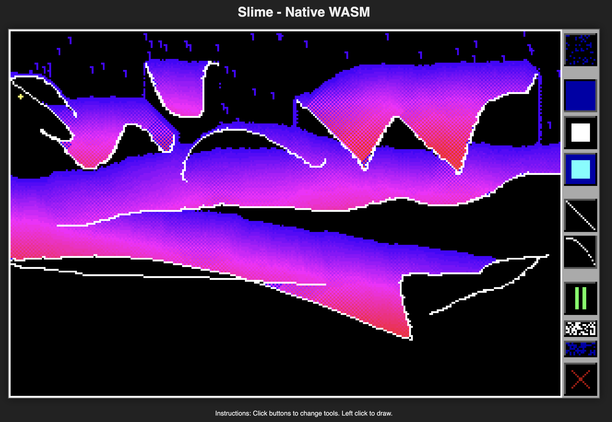

# Slime WASM (Native)



This is a native WebAssembly port of the classic "Slime" simulation (originally a DOS C++ program). It runs directly in the browser without Emscripten or a heavy runtime, using a minimal custom C++ environment.

## Prerequisites

To build this project, you need:

1.  **Clang / LLVM**: capable of compiling to the `wasm32` target.
    *   On macOS: `brew install llvm` (if system clang doesn't support wasm)
    *   On Linux: `sudo apt install clang lld`
2.  **Make**: Standard build tool.
3.  **Python 3** (Optional): For running a local development server.

## Building

Navigate to this directory and run:

```bash
make
```

This will compile the C++ source files in `src/` and link them into a `docs/slime.wasm` binary using the flags specified in the `Makefile`.

If you need to clean the build artifacts:
```bash
make clean
```

## Running

Because WebAssembly cannot be loaded directly from the file system (due to CORS policies), you must serve the files via a local web server.

A convenience command is provided in the Makefile to serve the `docs` directory:

```bash
make serve
```

Or you can run Python's http server manually:

```bash
python3 -m http.server 8000 -d docs
```

Then open your browser and go to:
[http://localhost:8000/index.html](http://localhost:8000/index.html)

## Project Structure

*   `src/`: C++ source code.
    *   `main.cpp`: Main game loop, rendering, physics simulation, and UI logic.
    *   `platform.h`: Platform abstraction with simulation constants (`FIELD_WIDTH`, `WALL_VALUE`, etc.) and bounds-checking helpers.
    *   `button.cpp/h`: UI Button implementation.
    *   `mouse.cpp/h`: Mouse state handling.
*   `docs/index.html`: The web entry point. Contains the JavaScript runtime that loads the WASM, handles input, and renders the video buffer to a wrapper Canvas.
*   `Makefile`: Build configuration.
*   `imports.sym`: List of symbols allowed to be undefined (imported from JS).

## Code Architecture

The C++ code uses modern practices for maintainability:

*   **Constants**: `constexpr` values in `platform.h` for simulation parameters
*   **Enums**: `enum class` for `Tool`, `Action`, and `EraserMode` instead of raw integers
*   **State Structs**: `GameState` and `InputState` group related global variables
*   **Bounds Helpers**: `inField()` and `inScreen()` inline functions

### Water Color Gradient

Water color reflects pressure/density, matching the original DOS version:
- **Blue** (surface) → **Purple** → **Red** → **Yellow** (high pressure at bottom)

## How it Works

*   **No Emscripten**: This project does not use Emscripten. It defines its own minimal "standard library" replacements in `platform.h` to keep the binary extremely small and the build process transparent.
*   **Memory**: The C++ code writes to a static `video_buffer` (RGBA). JavaScript accesses this memory directly via the WASM exports and puts the image data onto the HTML5 Canvas.
*   **Input**: JavaScript captures mouse usage and calls exported C++ functions (`set_mouse_pos`, `update`) to pass the state to the engine.

